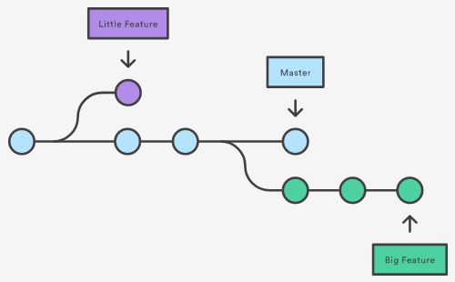

Branching is a feature available in most modern version control systems. Branching in other VCS's can be an expensive 
operation in both time and disk space. In Git, branches are a part of your everyday development process.

Git branches are effectively a pointer to a snapshot of your changes. When you want to add a new feature or fix a bug—no 
matter how big or how small—you spawn a new branch to encapsulate your changes. This makes it harder for unstable code 
to get merged into the main code base, and it gives you the chance to clean up your future's history before merging it 
into the main branch.



The diagram above visualizes a repository with two isolated lines of development, one for a little feature, and one 
for a longer-running feature. By developing them in branches, it's not only possible to work on both of them in parallel, 
but it also keeps the main master branch free from questionable code.

## Task

### Prepare environment

To start off we need to prepare the environment, go ahead and clone the repository you created in the previous lab with:

`git clone https://git.itworx.cloud/<username>/simple-html-app.git .`

And change directory into the cloned repository;

```cd simple-html-app/```{{execute}}

And inspect all branches in the repository with;

```git branch```{{execute}}

Which shows that you have one branch only called **master**. This is synonymous with `git branch --list`.

### Creating Branches

It's important to understand that branches are just pointers to commits. When you create a branch, all Git needs to do is 
create a new pointer, it doesn't change the repository in any other way. Then, you create a branch using the following command:

```git branch my-feature```{{execute}}

```git branch delete-me```{{execute}}

The repository history remains unchanged. All you get is a new pointer to the current commit.

Note that this only creates the new branch. To start adding commits to it, you need to select it with git checkout, and 
then use the standard git add and git commit commands.

```git checkout my-feature```{{execute}}

And inspect all branches in the repository with;

```git branch```{{execute}}

Which will show you that you now have three branches and that the currently active branch is **my-feature**.

Let's introduce some changes and cause the history to diverge a little bit, create a new file called `about.html`{{open}} 
and add the below content to the file;

<pre class="file" data-filename="./about.html" data-target="replace">
On this page you'll find the about us!
</pre>

Let's add and commit our changes with;

```git add about.html```{{execute}}

```git commit -m 'Add about us page'```{{execute}}

Now let's diverge the `delete-me` branch, go ahead and create a new file called `delete-me.html`{{open}} and add the below 
content to the file;

<pre class="file" data-filename="./delete-me.html" data-target="replace">
Useless content that will be trashed later on!
</pre>

Let's add and commit our changes with;

```git add delete-me.html```{{execute}}

```git commit -m 'To be deleted later on'```{{execute}}

### Creating remote branches

So far we've been working on local branch operations. The `git branch` command also works on remote branches. In order to 
operate on remote branches, a remote repo must first be configured and added to the local repo config.

```git push -u origin my-feature```{{execute}}

This command will push a copy of the local branch _my-feature_ to the remote repo origin.

### Deleting branches

Once you've finished working on a branch and have merged it into the main code base, you're free to delete the branch 
without losing any history with. You'll need to switch to a different branch first before deleting the intended branch.

```git checkout master```{{execute}}

```git branch -d delete-me```{{execute}}

The `-d` option tells git to delete the branch. But it will complain that the branch has not been fully merged yet. This 
is a safegaurd before losing a branch by mistake that has not been merged yet. Use `-D` to delete branch (even if not merged);

```git branch -D delete-me```{{execute}}

Pushed branches may still exist in remote repos after they've been deleted from the local repository. To delete a remote 
branch execute the following.

```git push origin --delete my-feature```{{execute}}

This will push a delete signal to the remote origin repository that triggers a delete of the remote my-feature branch.
